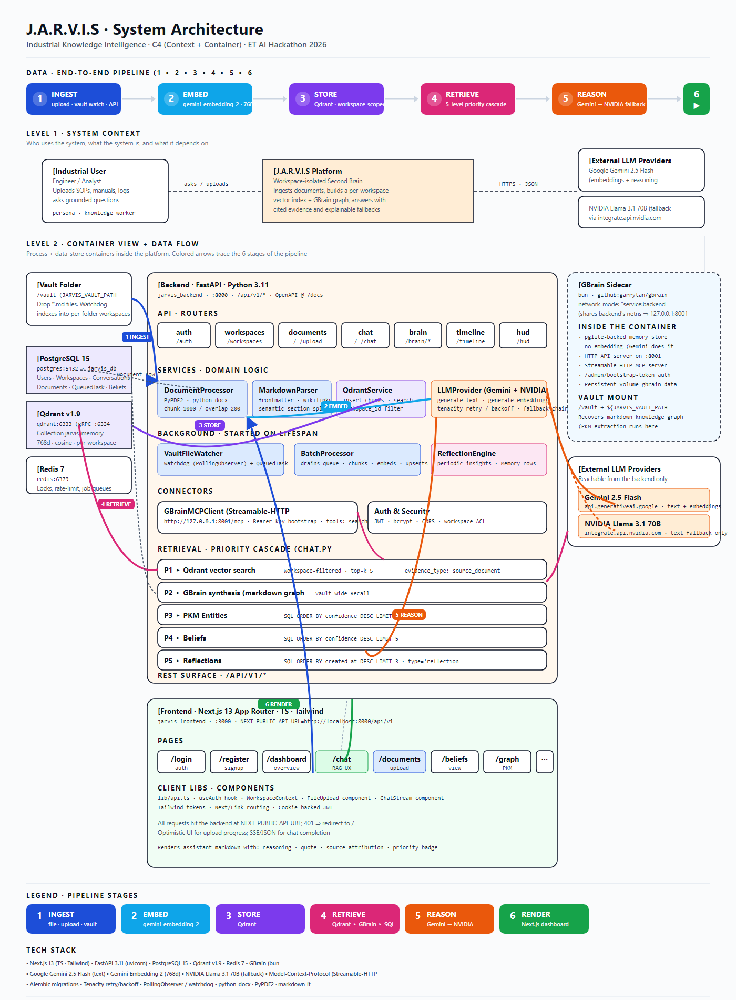

# J.A.R.V.I.S — Industrial Knowledge Intelligence

> **Just A Rather Very Intelligent System** · ET AI Hackathon 2026 · Problem #8

J.A.R.V.I.S grounds every answer in the operator's own documents, notes, and
prior captures. It combines a retrieval-augmented chat UX with a personal
knowledge graph, reflection engine, and a local note-graph sidecar (GBrain)
so the answer cites *what you have*, not what the model trained on.



The full data flow — Ingest → Embed → Qdrant → Retrieve → Reason → Render —
is captured above. The SVG source and a generation script live at
[`docs/architecture/`](docs/architecture/).

## Quick start

```bash
# 1. Configure secrets
cp .env.example .env               # then fill GEMINI_API_KEY + JWT_SECRET_KEY

# 2. Bring up the stack (Postgres + Qdrant + Redis + GBrain sidecar + backend + frontend)
docker compose up -d

# 3. Initialize GBrain once
docker compose exec backend gbrain init --pglite --no-embedding

# 4. Open
#    Frontend  http://localhost:3000
#    API docs  http://localhost:8000/docs
```

> NVIDIA key is optional — it's only requested the first time Gemini fails or
> rate-limits. See [Architecture → Security Notes](docs/architecture/README.md#security-notes).

## What's in the box

| Layer        | Tech                                                                    |
| ------------ | ----------------------------------------------------------------------- |
| Frontend     | Next.js 13 (App Router) · TypeScript · Tailwind                         |
| Backend      | FastAPI · Python 3.11 · SQLAlchemy · Alembic                            |
| Storage      | PostgreSQL 15 (truth) · Qdrant v1.9 (768d vectors) · Redis 7 (queues)   |
| Sidecar      | GBrain (bun + pglite · Streamable-HTTP MCP) sharing backend's netns     |
| LLMs         | Gemini 2.5 Flash (primary) · NVIDIA Llama 3.1 70B (fallback)            |

## Feature highlights

- **Workspace-scoped RAG** — every chunk carries `workspace_id`; the
  retriever never crosses tenant boundaries.
- **Five-source retrieval cascade** — Qdrant vector → GBrain note graph →
  PKM entities → Beliefs → Reflections. Each source fills gaps the prior
  sources missed.
- **Vault watcher** — drop a markdown file into `vault/`, get it indexed
  without restarting the backend.
- **Reflection engine** — periodic insights from your captures, surfaced
  in-timeline and on the HUD.
- **Background batch processor** — backfills embeddings on schedule so
  uploads don't block chat latency.

## Repo layout

```
backend/
  app/
    api/routers/        # auth, workspaces, documents, chat, brain, timeline, hud, explain
    services/           # document_processor, qdrant, llm_provider, file_watcher, batch_processor, reflection_engine, mcp_client
    core/               # config, security
    db/                 # models, session
frontend/
  app/                  # /login /register /dashboard /chat /documents /beliefs /graph /timeline
docs/
  architecture/         # SVG + PNG + build script (this README)
docker-compose.yml
.env.example
SPRINT_PLAN.md          # hour-by-hour sprint plan
```

## Documentation

- [`docs/architecture/`](docs/architecture/) — system architecture + script
  to rebuild the PNG.
- [`SPRINT_PLAN.md`](./SPRINT_PLAN.md) — five-day, hour-by-hour build plan
  (also exported as `.pdf`, `.html`, `.docx`).

## License

MIT — see [`LICENSE`](./LICENSE).
